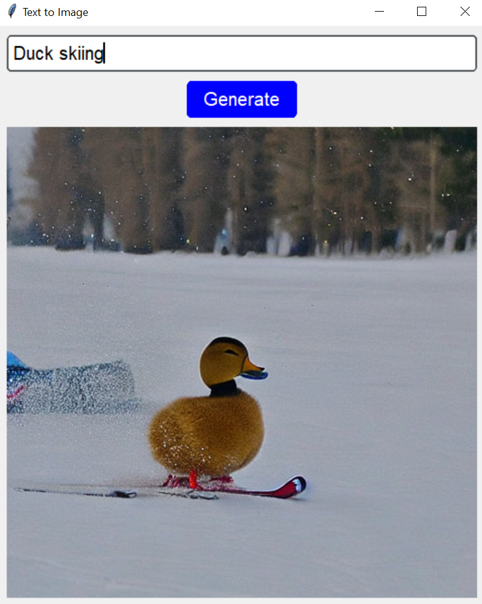
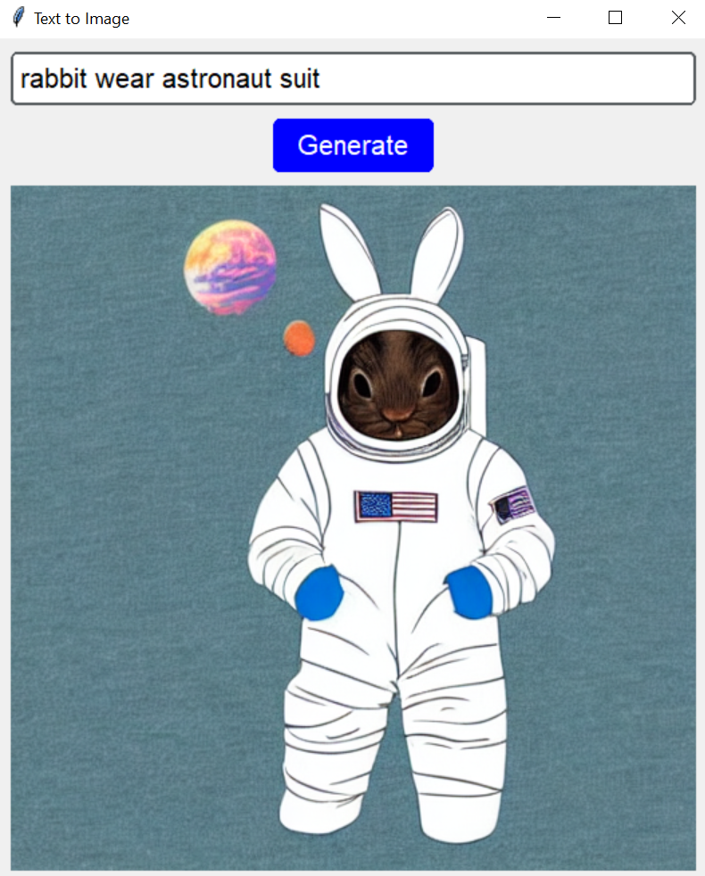
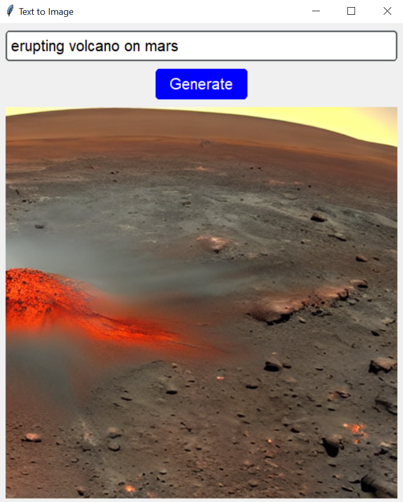

# Stable Diffusion Implementation - Text to Image
***Text to Image*** app with ***Stable Diffusion Pipeline*** and ***CustomTkinter*** as its UI.

Source :
1. Stable Diffusion App - [Github](https://github.com/nicknochnack/StableDiffusionApp), [HuggingFace](https://huggingface.co/CompVis/stable-diffusion-v1-4)
2. Custom Tkinter - [Github](https://github.com/TomSchimansky/CustomTkinter)


How to run:
1. Clone this repository
```python
git clone https://github.com/marwanmusa/Text-to-Image-with-StableDiffusion
```
2. Make virtual environment on your local directory
```python
python -m venv "your_env_name"
```
3. Activate the environment
```python
"your_env_name"/Scripts/Activate.ps1
```
4. Install dependencies in *requirements.txt*
```python
pip install -r path/to/requirements.txt
```
or if you are using pipenv, then
```python
pipenv install
```
if `pipenv` not installed yet, just
```python
pip install pipenv
```
5. Run `app.py`
```python
python app.py
```


Generated image samples:
1. Duck Skiing

<br>
2. Rabbit Astronaut

<br>
3. Erupting Volcano on Mars



> **Note** <br>
> You need to adjust your [torch](https://pytorch.org/) installation version to match with your [cuda toolkit](https://developer.nvidia.com/cuda-toolkit) version installed.
